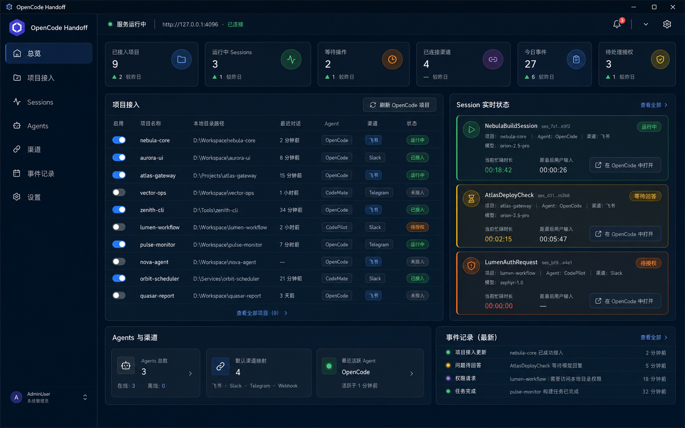

<div align="center">

# OpenCode Handoff

### 离开电脑，也不会错过 Agent 需要你的时刻。

[English](./README.md) | **简体中文**

当 OpenCode 需要你的回答、授权或关注时，通过飞书 / Lark 通知你，
并让你远程继续 **原来的 OpenCode Session**。

[](https://github.com/Hans2573/OpenCode-Handoff/releases/latest)


</div>



## OpenCode Handoff 是什么？

OpenCode Handoff 让你离开电脑时，仍能掌握 OpenCode Session 的关键进展。

当 OpenCode 完成任务、提出问题、请求授权或发生错误时，Handoff 会通过飞书 / Lark 通知你。

你可以直接用手机回复，消息会返回同一个 OpenCode Session。OpenCode 始终是主工作界面，也是完整对话的唯一事实源。

## 工作流程

```text
OpenCode
   ↓
执行中...
   ↓
完成 / 问题 / 授权 / 错误
   ↓
OpenCode Handoff
   ↓
飞书 / Lark
   ↓
回复 / 授权
   ↓
原 OpenCode Session 继续
```

OpenCode 始终是你的主工作界面。只有 Agent 需要你时，Handoff 才会介入。

它不是完整的 OpenCode ↔ 飞书聊天 Bridge，不会持续转发 Thinking、Token Stream、Tool Call 或每一条 Assistant 流式输出。

## 核心能力

- **远程 Session Handoff** — 从飞书 / Lark 精确继续原来的 OpenCode Session

- **远程创建 Session** — 从项目卡片创建 Session，并选择模型和推理档位

- **模型发现与切换** — 浏览 Provider、搜索模型、复用最近选择，并为下一条任务切换模型

- **实时状态与耗时统计** — 查看执行、重试、等待回答和待授权状态，以及当前模型、本轮执行时长和距上次输入时长

- **Question 与 Permission** — 通过交互卡片回答问题，或选择允许一次、始终允许和拒绝

- **完成、错误与停止控制** — 接收真正需要关注的通知，在错误后继续任务，或远程停止对应 Session

- **多项目路由** — 自主选择哪些本机项目可以通知你，并确保每条回复精确映射到正确 Session

- **桌面端与本地优先** — 管理项目、Session、连接、设置和事件历史，同时将运行数据保留在本机

详细配置和实现说明请查看下方专题文档。

## 快速开始

1. **下载 OpenCode Handoff**

   从 [GitHub Releases](https://github.com/Hans2573/OpenCode-Handoff/releases) 获取 Windows 安装包或便携版。

2. **启动 OpenCode Server**

   ```powershell
   $env:OPENCODE_SERVER_PASSWORD = "你的密码"
   opencode serve --hostname 127.0.0.1 --port 4096
   ```

3. **配置 OpenCode Handoff**

   在设置中填写 OpenCode 地址、凭据和飞书 / Lark 应用凭据。详见[配置参考](docs/configuration.md)。

4. **配置飞书 / Lark**

   创建并发布拥有机器人、消息和卡片回调能力的自建应用。按照[飞书 / Lark 配置](docs/feishu-setup.md)操作。

5. **绑定会话**

   将本地应用日志中显示的 `/bind <配对码>` 发送给机器人。

6. **启用项目**

   刷新 OpenCode 项目，然后为需要通知的项目启用 Handoff。

安装和升级说明见[安装指南](docs/installation.md)。

## 文档

| 指南 | 说明 |
| --- | --- |
| [安装指南](docs/installation.md) | 安装、运行、迁移和升级 OpenCode Handoff |
| [配置参考](docs/configuration.md) | 配置 OpenCode、通知、存储和安全选项 |
| [飞书 / Lark 配置](docs/feishu-setup.md) | 配置应用、权限、配对和机器人命令 |
| [开发指南](docs/development.md) | 从源码运行和验证项目 |
| [构建与发布](docs/build-and-release.md) | 构建桌面应用并打包 Windows 安装程序 |
| [架构说明](docs/architecture.md) | 了解产品边界、组件和数据流 |
| [旧版 CLI](docs/legacy-cli.md) | 运行无界面 CLI 或迁移到桌面端 |

## Roadmap

- Stall 检测与 Session timeout 处理
- 多 OpenCode 实例与机器标识
- 更完善的 Handoff 历史、诊断和通知路由
- 在不变成完整聊天 Bridge 的前提下扩展更多 Agent 与消息渠道

## License

本仓库目前尚未添加许可证文件。
